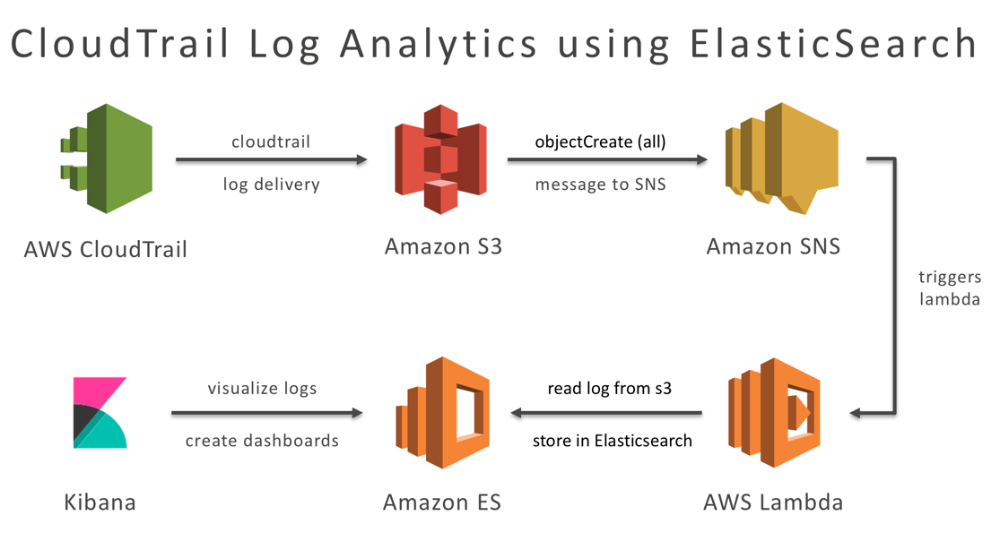

# CloudTrail Log Analytics using AWS Lambda and Amazon ElasticSearch Service
This AWS Serverless Application will help you analyze AWS CloudTrail Logs using 
Amazon Elasticsearch Service. The application creations CloudTrail trail, sets
the log delivery to an s3 bucket that it creates and configures SNS delivery 
whenever the CloudTrail log file has been written to s3 (AWS SAM). The app also
creates an Amazon Elasticsearch Domain and creates an Amazon Lambda Function which
will read the SNS message, get the s3 file location, read the contents from the s3
file and write the data to Elasticsearch for analytics.

This is the architecture of the CloudTrail Log Analytics Serverless Application

# 

The remainder of document explains how to prepare the Serverless Application and 
deploy it via AWS CloudFormation. 

## Prerequisites
- [python 2.7](https://www.python.org/download/releases/2.7/)
- [pip](https://bootstrap.pypa.io/get-pip.py)

## Install the required python packages for the AWS Lambda function 
```bash
$ python -m pip install -r requirements.txt -t ./
```

## Packing Artifacts
Before you can deploy a SAM template, you should first upload your Lambda 
function code zip. Set the `CodeUri` properties to the S3 URI of uploaded files. You
can choose to do this manually or use `aws cloudformation package` [CLI command](http://docs.aws.amazon.com/cli/latest/reference/cloudformation/package.html) to automate the task of uploading local artifacts to S3 bucket. The command returns a copy of your template, replacing references to local artifacts with S3 location where the command uploaded your artifacts. 

To use this command, set `CodeUri` property to be the path to your 
source code folder/zip/jar as shown in the example below. 

**This is already taken care for you, the above documentation is for reference**

```YAML
Function:
    Type: AWS::Serverless::Function
    Properties:
        CodeUri: ./
        ...
```

Run the following command to upload your artifacts to S3 and output a 
packaged template that can be readily deployed to CloudFormation.
```bash
$ aws cloudformation package \
    --template-file template.yaml \
    --s3-bucket bucket-name \
    --output-template-file serverless-output.yaml
```

The packaged template will look something like this:
```YAML
Function:
    Type: AWS::Serverless::Function
    Properties:
        CodeUri: s3://<mybucket>/<my-zipfile-path>
        ...
```

## Deploying to AWS CloudFormation
SAM template is deployed to AWS CloudFormation by [creating a changeset](http://docs.aws.amazon.com/AWSCloudFormation/latest/UserGuide/using-cfn-updating-stacks-changesets-create.html)
using the SAM template followed by [executing the changeset](http://docs.aws.amazon.com/AWSCloudFormation/latest/UserGuide/using-cfn-updating-stacks-changesets-execute.html). 
Think of a ChangeSet as a diff between your current stack template and the new template that you are deploying. After you create a ChangeSet, you have the opportunity to examine the diff before executing it. Both the AWS Console and AWS CLI provide commands to create and execute a changeset. 

Alternatively, you can use `aws cloudformation deploy` CLI command to deploy the SAM template. Under-the-hood it creates and executes a changeset and waits until the deployment completes. It also prints debugging hints when the deployment fails. Run the following command to deploy the packaged template to a stack called `cloudtrail-log-analytics`:

```bash
$ aws cloudformation deploy \
    --template-file serverless-output.yaml \
    --stack-name cloudtrail-log-analytics \
    --capabilities CAPABILITY_IAM
```

Refer to the [documentation](http://docs.aws.amazon.com/cli/latest/reference/cloudformation/deploy/index.html) for more details.

## Caveats:
The Amazon Elasticsearch Domain that the Serverless Application created sets the following access polices:
- Write access only to Function IAM role 
- Read access to everyone on the Kibana Plugin

I recommend reading about Access Policies using the below [documentation](http://docs.aws.amazon.com/elasticsearch-service/latest/developerguide/es-createupdatedomains.html#es-createdomain-configure-access-policies) and modify the Access policy to give full es:* access to your public IPs to the Elasticsearch Domain

You can learn more about Amazon Elasticsearch Domain Access Polices [here](http://docs.aws.amazon.com/elasticsearch-service/latest/developerguide/es-createupdatedomains.html#es-createdomain-configure-access-policies)
